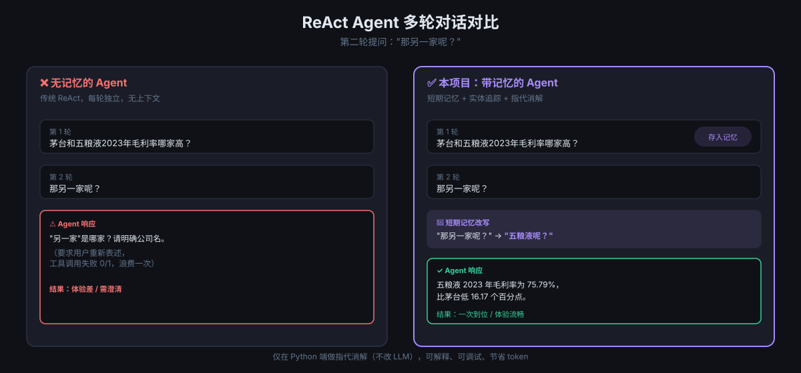
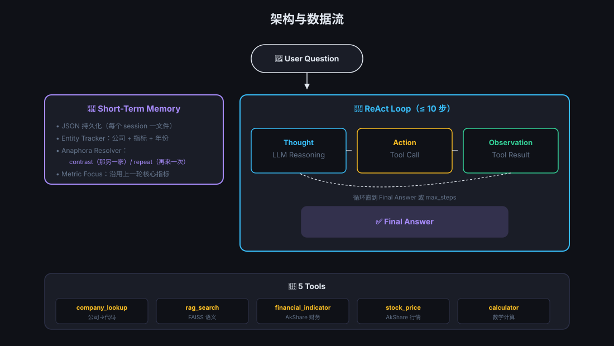
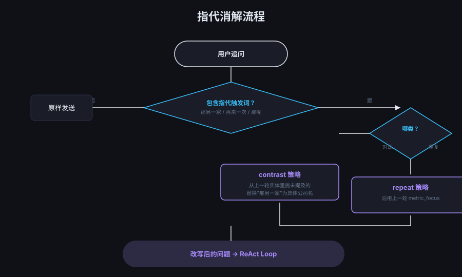

# 🧠 ReAct Financial Agent · 多轮记忆 + 指代消解

> 在 ReAct (Reasoning + Acting) Agent 范式上加入**持久化短期记忆**与**指代消解**，
> 让 Agent 能像人一样理解"那另一家呢？""那个呢？"这类追问。

[](https://www.python.org/)
[](LICENSE)
[](tests/test_memory.py)
[](tests/test_e2e.py)

---

## ⚡ 30 秒看懂

<p align="center">
  
</p>

```text
用户: 茅台和五粮液2023年毛利率哪家高？差多少？
Agent: [5 步工具调用] → 茅台 91.96% > 五粮液 75.79%，高 16.17 个百分点

用户: 那另一家呢？
       ↓ 短期记忆自动改写 ↓
Agent: [3 步工具调用，只查五粮液] → 五粮液 2023 年毛利率 75.79%
```

**关键点**：第二轮提问里没有"五粮液"三个字，Agent 通过上一轮实体列表自动推断出指代对象。

---

## 🎯 解决什么问题

通用 LLM 在多轮对话中往往"金鱼记忆"：

| 用户追问 | 无记忆 Agent | 本项目 |
|---------|------------|--------|
| `那另一家呢？` | 不知指代谁，反问用户 | 自动改写为 `五粮液呢？` |
| `再来一次` | 当作新问题重新分析 | 沿用上一轮关注的指标 |
| `它去年的情况呢？` | 不知"它"是谁 | 从实体表里查找上一轮最后一个 |

---

## ✨ 特性

- 🔁 **ReAct 双实现对比** —— 手写 Prompt 解析 vs Function Calling API
- 💾 **持久化短期记忆** —— 每个会话独立 JSON 文件，跨进程持久化
- 🎯 **实体追踪** —— 自动识别公司名 / 指标 / 年份
- 🔀 **指代消解** —— 对比类 (`那另一家`) / 重复类 (`再来一次`) 两类改写策略
- 🌐 **Web UI** —— 实时展示 ReAct 步骤、改写横幅、记忆侧栏
- 🧪 **测试覆盖** —— 36 个单元测试 + 1 个端到端集成测试

---

## 🏗️ 架构

<p align="center">
  
</p>

```text
┌─────────────────────────────────────────────────────────────┐
│                     User Question                           │
└────────────────────────┬────────────────────────────────────┘
                         ▼
              ┌──────────────────────┐
              │ Short-Term Memory    │ ◀── data/memory/<sid>.json
              │ + Entity Tracking    │
              │ + Anaphora Resolution│
              └──────────┬───────────┘
                         ▼ (rewritten question)
        ┌────────────────────────────────────────┐
        │  ReAct Loop (≤ 10 steps)               │
        │  ┌─────────┐  ┌─────────┐  ┌────────┐  │
        │  │ Thought │→ │ Action  │→ │  Obs   │  │
        │  │   LLM   │  │  Tool   │  │ Result │  │
        │  └─────────┘  └────┬────┘  └───┬────┘  │
        │       ▲            │           │       │
        │       └────────────┴───────────┘       │
        └────────────────────┬───────────────────┘
                             ▼
                      Final Answer
                             ▼
                  ┌──────────────────────┐
                  │ Write to Memory      │
                  └──────────────────────┘
```

5 个工具：

| 工具 | 用途 |
|------|------|
| `company_lookup` | 公司名 → 股票代码（防幻觉） |
| `rag_search` | FAISS 语义检索年报（1024 维 / 10353 条） |
| `calculator` | 安全数学表达式计算 |
| `financial_indicator` | AkShare 实时财务指标 |
| `stock_price` | AkShare 历史股价与涨跌幅 |

---

## 📁 项目结构

```
react-llm-memory-agent/
├── README.md                ← 本文档
├── ARCHITECTURE.md          ← 技术方案详解（原项目文档）
├── MEMORY_GUIDE.md          ← 短期记忆 + 指代消解使用指南
├── REPORT.md                ← 实验报告（含 36/36 单元测试 + E2E 结果）
├── requirements.txt
├── index.html               ← Web UI
├── src/
│   ├── memory.py            ← 短期记忆 + 实体追踪 + 指代消解
│   ├── react_manual.py      ← 手写 Prompt 解析版 ReAct
│   ├── react_function_calling.py  ← Function Calling 版 ReAct
│   ├── agent.py             ← CLI 统一入口
│   ├── serve.py             ← FastAPI HTTP 服务
│   ├── tools.py             ← 5 个工具实现
│   └── evaluate.py          ← 两种实现对比评估
├── tests/
│   ├── test_memory.py       ← 36 个单元测试
│   └── test_e2e.py          ← REST API + ReAct + 记忆闭环测试
└── data/
    └── memory/              ← 运行时自动生成的 JSON 持久化目录
```

---

## 🚀 快速开始

### 1. 安装依赖

```bash
git clone https://github.com/<your-username>/react-llm-memory-agent.git
cd react-llm-memory-agent
pip install -r requirements.txt
```

### 2. 配置 LLM Key

```bash
export DASHSCOPE_API_KEY="sk-..."
# 或 DeepSeek / OpenAI（修改 src/react_function_calling.py 中的 base_url）
```

### 3. （可选）准备年报 FAISS 索引

仓库不含 `vectorstore/faiss_index.bin`（56MB 过大），从原 `课件/week12 agent/react_financial_agent/vectorstore/` 拷贝或自行重建：

```bash
mkdir -p vectorstore
# 把 faiss_index.bin 和 faiss_meta.json 放到这里
```

### 4. 运行测试

```bash
python tests/test_memory.py     # 36/36 单元测试
python tests/test_e2e.py        # REST + ReAct + 记忆闭环
```

### 5. CLI 多轮演示

```bash
# 第一轮：建立记忆
python src/agent.py --mode manual --session demo \
    --question "贵州茅台和五粮液2023年毛利率哪家高？"

# 第二轮：触发指代消解
python src/agent.py --mode manual --session demo \
    --question "那另一家呢？"

# 清空记忆重新演示
python src/agent.py --mode manual --session demo --reset
```

### 6. Web UI

```bash
uvicorn src.serve:app --host 0.0.0.0 --port 8000
# 浏览器打开 http://localhost:8000
```

---

## 🔍 指代消解规则速览

<p align="center">
  
</p>

`src/memory.py` 中的 `rewrite_follow_up()`：

| 触发词 | 策略 | 改写逻辑 |
|--------|------|---------|
| 那另一家、那另一个、那家 | `contrast` | 从上一轮实体里挑"未在本轮被提到"的最后一个 |
| 那呢、再来一次、也一样 | `repeat` | 沿用上一轮 `metric_focus`，追加提示 |
| 无触发词 | — | 不改写，原样发送 |

**改写示例**（上下文：上一轮提到 [贵州茅台, 五粮液]）：

| 用户输入 | 改写结果 | 说明 |
|---------|---------|------|
| `那另一家呢？` | `五粮液呢？` | 取未提及的最后一个 |
| `那茅台呢？` | （不改写） | 用户已具体指明 |
| `再来一次` | `再来一次（沿用上一轮关注的指标：毛利率）` | 提示 LLM 沿用 |

---

## 🧪 测试结果

```
memory.py 单元测试：36/36 通过
端到端测试：会话创建 → 首轮 → 改写追问 → 记忆写入 → 清空 → 跨模式（FC 版）全部通过
```

详见 [`REPORT.md`](REPORT.md)。

---

## 🛠️ 技术栈

- **LLM**：DashScope (Qwen) / DeepSeek / OpenAI 兼容协议
- **Agent 框架**：自研 ReAct（手写 + Function Calling 双实现）
- **RAG**：FAISS + text-embedding-v3
- **数据**：AkShare（A 股实时财务 + 行情）+ 5 家公司年报 PDF
- **后端**：FastAPI + SSE 流式响应
- **前端**：原生 HTML + CSS + JS，无框架依赖

---

## 📚 设计取舍

| 决策 | 取舍 | 影响 |
|------|------|------|
| 改写在 Python 端做 | 不依赖 LLM | 可控、可解释、节省 token |
| 短期记忆 = 单会话 JSON | 简单 | 跨进程持久，跨会话不共享 |
| 公司词典硬编码 5 家 | 与工具同步 | 新增公司需同步改 `tools.py` 与 `memory.py` |
| 触发词规则匹配 | 教学友好 | 复杂语义兜底依赖 LLM |

---

## 📄 License

MIT

---

## 🙋 关于

这是一个**教学导向**的完整 ReAct Agent 实现，重点展示：

1. **ReAct 范式的两种工程实现**（手写 vs Function Calling）及其权衡
2. **多轮对话记忆**的最小可行实现（JSON 持久化 + 实体追踪 + 指代消解）
3. **RAG + Tool + LLM** 的协同工作流

适合作为 LLM Agent 学习的参考实现与简历项目展示。